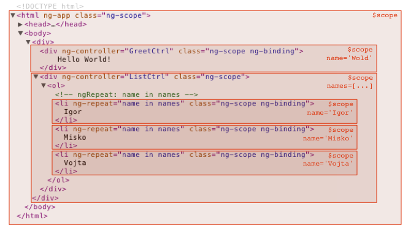

# Introduction Of Angularjs
本文中所有的链接都来自 angularjs 官方文档, 由于被墙的原因。访问不了的链接可以在
[http://docs.angularjs.cn/](http://docs.angularjs.cn/) 找到对应的 Mirror

### notation

!! high value

# what is angularjs
angularjs 是 google 开发的前端 MVC 框架, 主要的目标就是简化前端富客户端的开发。

# its design goals

* to decouple DOM manipulation from application logic
* to decouple the client side of an application from the server side.
* to provide structure for the journey of building an application: from designing the UI, through writing the business logic, to testing.

# a simple angularjs example

# angularjs in birdview

## two way data-bindings

# angular js components

## templates

模板是一段包含 angularjs 表达式的 html 文本 eg:

    <button ng-click="sayHi()">Make Me Speak!</button>

模板的引入方式:

* 直接写在 html 格式的文件中

* 通过嵌入 script 标签

        

* 通过js嵌入

        var myApp = angular.module('myApp', []);
        myApp.run(function($templateCache) {
          $templateCache.put('templateId.html', 'This is the content of the template');
        });

## controller
控制器是控制前端的展现和前端的输入的代码段. 主要通过 scope 来实现和前端View层的数据绑定

声明控制器的方式:

    var myApp = angular.module('myApp',[]);

    myApp.controller('GreetingController', ['$scope', function($scope) {
      $scope.greeting = 'Hola!';
    }]);

在 template 中使用:

    

      {{ greeting }}
    

控制器的 scope 的关系:
默认的情况下, 每一个控制器都会关联一个scope, 而scope的之间的关系是可以嵌套, 内层的scope默认继承外层的scope的属性的。

## scope
scope 是angularjs中用来隔离程序逻辑单元的一个上下文对象。有点像编程语言中的包对象。

scope 的类别:

* isolate scope
* default scope

scope 的行为:

scope 默认可以通过模板中ng-controller指令的方式互相嵌套从而达到继承的。

isolate scope:
isolate scope 不会从外层的 scope 继承任何属性, 多运用在directive中:

    myModule.directive('directiveName', function factory(injectables) {
        return {
            scope: {}
        }
    }

## expression
>Angular expressions are JavaScript-like code snippets that are usually placed in bindings such as {{ expression }}

For example, these are valid expressions in Angular:

* 1+2
* a+b
* user.name
* items[index]

Angular Expressions vs. JavaScript Expressions:
[angularjs expression](http://docs.angularjs.cn/guide/expression)

## filter
>A filter formats the value of an expression for display to the user. They can be used in view templates, controllers or services and it is easy to define your own filter.

Using filters in view templates

    {{ expression | filter:argument1:argument2:... }}

    eg.

    {{ 1234 | number:2 }} 输出 1,234.00

Using filters in controllers, services, and directives:
todo:

自定义filter:

[Creating custom filters](http://docs.angularjs.cn/guide/filter)

## module
module 你可以看做像编程语言的主工程的名称或者多工程构建中的各个工程的工程名称，用于分割组织程序代码

    //
    var <module_variable_name> = angular.module('<module_name>', ['deps, ...']);

    eg:

    angular.module('xmpl', ['xmpl.service', 'xmpl.directive', 'xmpl.filter'])

## DI(Dependence Injection):
angularjs 是主要通过依赖注入和Module来组织和分割angularjs工程的代码

    // module injection
    angular.module('xmpl', ['xmpl.service', 'xmpl.directive', 'xmpl.filter'])

    //
    angular.controller('controller', ['$scope', function($scope){

        }])

    angular.directive('directive name', function(){
        return {
            controller: ['$scope', function($scope){

            }]
        }
    })

## [directives(指令)](https://docs.angularjs.org/guide/directive)
directive 是angularjs来封装和重用前端组件的方式

diretive 声明的方式:

简单的例子:

    angular.module('docsSimpleDirective', [])
        .controller('Controller', ['$scope', function($scope) {
            $scope.customer = {
                name: 'Naomi',
                address: '1600 Amphitheatre'
            };
        }])
        .directive('myCustomer', function() {
            return {
                template: 'Name: {{customer.name}} Address: {{customer.address}}'
            };
        });

directive 的使用方式

    //myDir
    <my-dir></my-dir> # element
     # attribute
    <!-- directive: my-dir exp --> # comment
     # class

常见的指令:

    ng-if, ng-show, ng-hide, ng-repeat, ng-bind, ng-src, ng-class, ng-init, ng-pattern

[!! ng-if 和 ng-show 的区别](http://stackoverflow.com/questions/19177732/what-is-the-difference-between-ng-if-and-ng-show-ng-hide)

更加完整的demo:

    myModule.directive('directiveName', function factory(injectables) {
        var directiveDefinitionObject = {
            priority: 0,
            template: '

', // or // function(tElement, tAttrs) { ... }, function 返回的是template string, tAttrs 是一个map对象 通过 tAttr.<prop_name> 来访问对应的属性值
            // or
            // templateUrl: 'directive.html', // or // function(tElement, tAttrs) { ... }, function 返回的也是最终的html的地址
            transclude: false,
            restrict: 'A', //AEC, A: attribute, E: element, C: classname, M: comment

            // - scope {Ojbect} : 默认是指令访问的 scope 都是外层controller的, 也就是继承的关系, 如果用这个属性, 就会创建一个
            //  isolate scope,
            //        `=<prop_name>` 表示需要外部传递值, 这个地方时双向绑定的
            //        '@=<prop_name>' 表示字符串的值,
            //        '&=<prop_name>' 表示引用函数或者expression名称 ideal for callbacks
            //  if `prop_name` is unspicified, then it is same with prop name of scope obj.
            // -明确制定 scope 的 好处就是需要外部明确传递值, 比较适合 directive 和 外部 controller 不是耦合的很紧的情况
            scope: false,

            // controller 和 link 的区别就是 如果需要指令间共享方法, 就需要通过controller定义行为, 然后另一个指令通过 require 的方式导入
            // 当然这是针对 isolate scope 说的
            // http://stackoverflow.com/questions/15676614/directive-link-vs-compile-vs-controller
            controller: function($scope, $element, $attrs, $transclude, otherInjectables) {...
            },

            controllerAs: 'stringAlias',

            // - or // ['^parentDirectiveName', '?optionalDirectiveName', '?^optionalParent'],
            // `^`: recursively walk up. default just find in its own controller, `?`: suppress error if not found
            require: 'siblingDirectiveName',

            //tElement : refere to template dom
            compile: function compile(tElement, tAttrs, transclude) {
                return {
                    // in link, scope, nested scope already created, and provide an iElement (which is jquery lite) instance.
                    // I personally always use iElem as parameter name in a link function to refer to the element instance.
                    pre: function preLink(scope, iElement, iAttrs, controller) {...
                    },
                    post: function postLink(scope, iElement, iAttrs, controller) {...
                    }
                }
                // or
                // return function postLink( ... ) { ... }
            },
            // or
            // link: {
            //  pre: function preLink(scope, iElement, iAttrs, controller) { ... },
            //  post: function postLink(scope, iElement, iAttrs, controller) { ... } //scope 最接近的scope, iElement {jqLite}: directive 的 jqLite wrapped obj.
            // }
            // or
            // link: function postLink( ... ) { ... } // 可以在link中做一些初始化的动作 具体看 http://docs.angularjs.cn/guide/directive 最后一个demo
        };
        return directiveDefinitionObject;
    });

## [HTML Compiler](https://docs.angularjs.org/guide/compiler)

#### Compiler:
Compiler is an Angular service which traverses the DOM looking for attributes. The compilation process happens in two phases.

* Compile: traverse the DOM and collect all of the directives. The result is a linking function.
* Link: combine the directives with a scope and produce a live view. Any changes in the scope model are reflected in the view, and any user interactions with the view are reflected in the scope model. This makes the scope model the single source of truth.

#### ！！指令是如何编译的(动态指令的关键)

* $compile traverses the DOM and matches directives.
* Once all directives matching a DOM element have been identified, the compiler sorts the directives by their priority.
* $compile links the template with the scope by calling the combined linking function from the previous step. This in turn will call the linking function of the individual directives, registering listeners on the elements and setting up $watchs with the scope as each directive is configured to do.

>

    var $compile = ...; // injected into your code
    var scope = ...;
    var parent = ...; // DOM element where the compiled template can be appended

    var html = '

';

    // Step 1: parse HTML into DOM element
    var template = angular.element(html);

    // Step 2: compile the template
    var linkFn = $compile(template);

    // Step 3: link the compiled template with the scope.
    var element = linkFn(scope);

    // Step 4: Append to DOM (optional)
    parent.appendChild(element);

## [Providers](https://docs.angularjs.org/guide/providers)
Provider 是 angularjs 中各个提供不同功能的组件的泛称.

常见的 Provider 如下

* constant
* factory
* service
* provider
* value

[factory 和 service 的区别](http://stackoverflow.com/questions/15666048/angularjs-service-vs-provider-vs-factory)

factory 每次被注入都是 new 出来新的对象, service 是一种单例(singleton)的实现, 这意味着你每次拿到的总是同一个
对象.

## Routers

    angular.module('createAD', [])
        .config(['$routeProvider', function($routeProvider) {

            $routeProvider
                .when('/campaign/:campaignID?', {
                    templateUrl: function(urlattr) {
                        if (urlattr.campaignID) {
                            return '/campaign/ajax-campaign-template?campaignid=' + urlattr.campaignID;
                        }
                        return '/campaign/ajax-campaign-template';
                    }
                })
                .when('/campaign/:campaignID/group/:groupID?', {
                    controller: 'groupCtrl',
                    templateUrl: '/adgroup/ajax-adgroup-template',
                })
                .when('/campaign/:campaignID/group/:groupID/idea/:ideaID?', {
                    controller: 'ideaCtrl',
                    templateUrl: '/adcreative/ajax-creative-template'
                })
                .when('/campaign/:campaignID/group/:groupID/idea-batch-edit', {
                    controller: 'batchIdeaCtrl',
                    templateUrl: '/ad_process/template/batch-idea-edit.html'
                })
                .otherwise({
                    redirectTo: '/campaign'
                });
        }])

## [!! form validation](https://docs.angularjs.org/guide/forms)

## https://docs.angularjs.org/guide/component

# Advance Topics

## 组件间的沟通方式

* Build-in Mechanism
    $scope.$on
    $scope.$emit
    $scope.$broadcast

* 3rd party pub/sub lib

## performance tuning
http://tech.small-improvements.com/2013/09/10/angularjs-performance-with-large-lists/
https://www.binpress.com/tutorial/speeding-up-angular-js-with-simple-optimizations/135
http://blog.scalyr.com/2013/10/angularjs-1200ms-to-35ms/

## Productionaize angularjs projects

[Packaging and Deploying AngularJS Web Applications(需翻墙)](https://www.google.com.hk/url?sa=t&rct=j&q=&esrc=s&source=web&cd=1&ved=0ahUKEwiYyYD_ztXKAhXBrKYKHVS3DGQQFggaMAA&url=https%3A%2F%2Fmasteringmean.com%2Flessons%2F345-Packaging-and-Deploying-AngularJS-Web-Applications&usg=AFQjCNH9GEFaSVgvMNk5LboREAmHla4Ahg&cad=rja)

[http://blog.jhades.org/what-every-angular-project-likely-needs-and-a-gulp-build-to-provide-it/](http://blog.jhades.org/what-every-angular-project-likely-needs-and-a-gulp-build-to-provide-it/)

## plugin libs

https://github.com/angular-ui/ui-router
https://angular-ui.github.io/bootstrap/
https://github.com/ocombe/ocLazyLoad

# Recommend Books
[AngularJS(2013.4)].Brad.Green.Oreilly
[Mastering.Web.Application.Development.with.AngularJS(2013.8)].Peter.Bacon.Darwin.文字版

# 结语
angularjs 在给我们提供实现前段富客户端便利的同时 也给我们带来新的挑战 angularjs是一个完整的框架 各个组件都有各个自己
的生命周期 各个组件的运用方式 也需要按照 angularjs 的内在方式进行 如何选择哪个组件和以何种方式实现逻辑功能 还有注意
angularjs项目的性能和内存泄露等问题 这些富客户端产品的内在本质的问题 也是前端工程师需要考虑的

